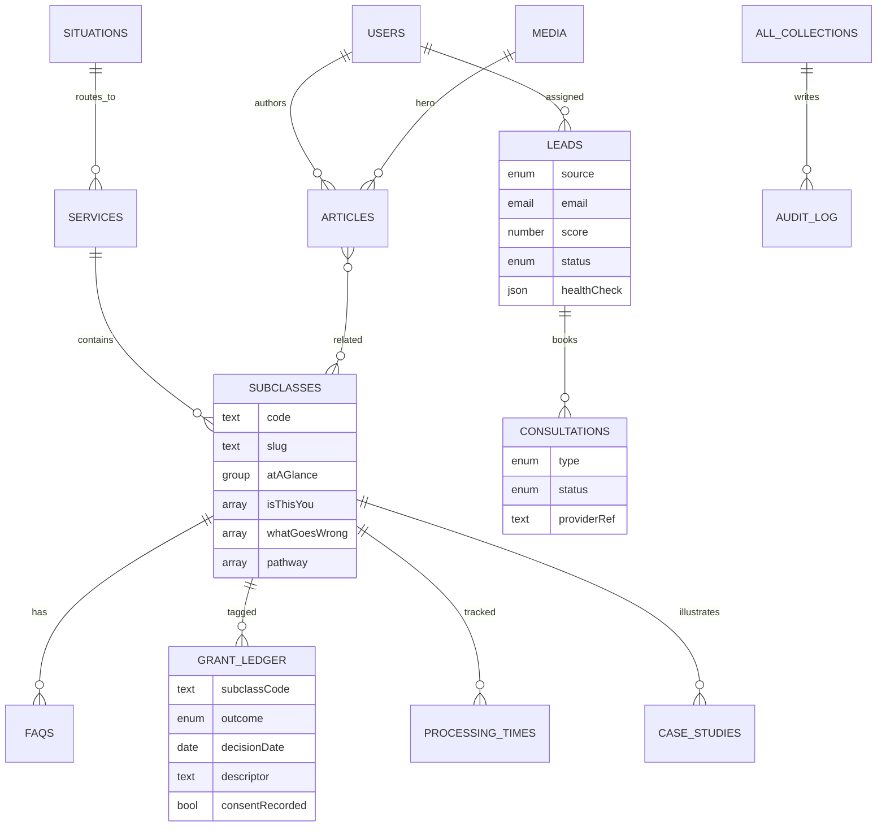
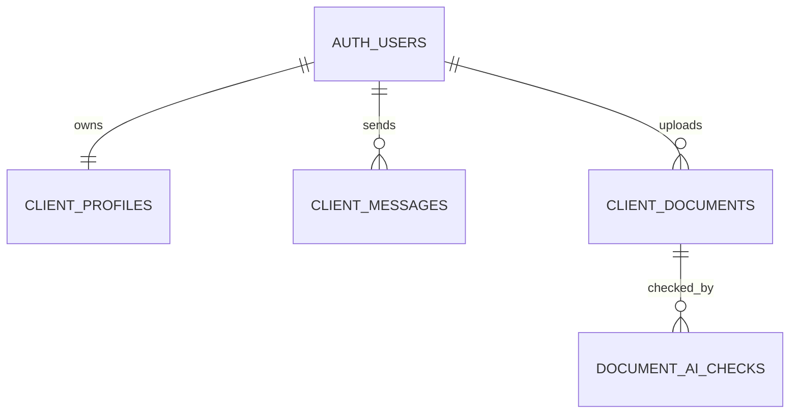

# Database Architecture

Two planes on one Postgres database (ADR-0002). **Plane A** is Payload-owned (content +
operations; access = Payload RBAC). **Plane B** is Supabase-owned (client portal; access =
RLS via `auth.uid()`). They share ids, not credentials.

## ERD (Plane A — content & operations)

## ERD (Plane B — client portal, RLS)

## Tables & indexes

- **16 Payload collections** (Plane A): Users, Media, Articles, Services, Subclasses,
  Situations, FAQs, Testimonials, CaseStudies, GrantLedger, ProcessingTimes,
  PinnedReviews, Leads, Consultations, Redirects, AuditLog. Payload generates the DDL;
  hot lookup fields carry `index: true` (slugs, `status`, `category`, `source`,
  `email`, `score`, dates, `subclassCode`, `outcome`).
- **Plane B** (`supabase/migrations`): `client_profiles`, `client_messages`,
  `client_documents`, plus AI-ready `article_embeddings` (pgvector) and
  `document_ai_checks`. Indexes on `(user_id, created_at desc)`.

## Access & security

- **Plane A:** Payload RBAC (`packages/auth` roles). Leads/Consultations are
  **create: server-only** — the browser never writes them, so the service-role key
  never ships to a client (CI-verified). AuditLog is append-only, admin-read.
- **Plane B:** RLS enabled on every table; one policy file per table in
  `supabase/policies/`. Clients read/write only rows where `auth.uid() = user_id`.
  AI tables have RLS enabled with **no** permissive policy → deny-by-default (service
  role only).

## Storage & media

Supabase Storage: `vmd-media` (public, optimised images) and `vmd-client-docs`
(private; signed URLs after an ownership check; type/size limits; encryption at rest).
See `supabase/storage.md`.

## Compliance guardrails (schema-enforced)

Grant Ledger stores no names, no photos, no rates/percentages; `consentRecorded` is
**required** on every entry; the descriptor is coarse and non-identifying. The standing
disclaimer is rendered by the UI, not stored per row (Blueprint §10.3).

## Future AI compatibility (ADR-0003)

Structured (not blobbed) Health Check data; `pgvector` embeddings table ready for
semantic search/AI-citation; `document_ai_checks` for a future swappable document
checker; `provider`/`provider_ref` on documents for OneDrive mirroring. None active at launch.
